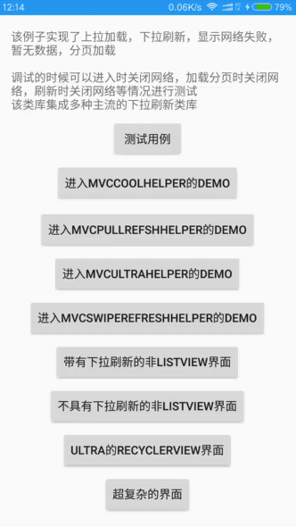

[TOC]

### MVCHelper主要用于下拉刷新加载，失败，加载，空数据，成功的界面切换。
MVCHelper +（IDataSource或ITask）+ IDataAdapter + 下拉刷新控件 + 布局切换（ILoadViewFactory，ILoadView，ILoadMoreView）

### TaskHelper主要用于没有布局切换和刷新控件的MVC架构，可以执行多个任务通过回调ICallback更新UI
TaskHelper+（ITask或IDataSource）+ ICallBack

Download sample [Apk](https://github.com/LuckyJayce/MVCHelper/blob/master/raw/MVCHelper_Demo.apk?raw=true)  
  
### 历史版本和更新信息  
https://github.com/LuckyJayce/MVCHelper/releases

### 常见疑惑集锦
  [Info.md](https://github.com/LuckyJayce/MVCHelper/blob/master/Info.md)

# Gradle导入 #
## 1.必须导入： ##
	
	//MVCHelper核心类库
	compile 'com.shizhefei:MVCHelper-Library:1.3.2'
	//里面有使用recyclerview，所以需要导入recyclerview
    compile 'com.android.support:recyclerview-v7:24.0.0'

## 2.可选：   ##
<1>  使用 https://github.com/LuckyJayce/CoolRefreshView 的刷新控件导入
 支持任意View的刷新 ，支持自定义Header，支持NestedScrollingParent,NestedScrollingChild的事件分发，嵌套ViewPager不会有事件冲突

	//里面包含一个MVCCoolHelper 是适配这个控件的 MVCHelper
    compile 'com.shizhefei:MVCHelper-CoolRefresh:1.3.2'
    compile 'com.shizhefei:CoolRefreshView:1.0.1'
    compile 'com.android.support:support-v4:24.0.0'

<2>  使用 https://github.com/chrisbanes/Android-PullToRefresh 的刷新控件导入

	//里面包含一个MVCPullrefshHelper 是适配这个控件的 MVCHelper
    compile 'com.shizhefei:MVCHelper-Pullrefresh:1.3.2'
	//由于没有找到gradle排至，我自己把它上传到jcenter上
    compile 'com.shizhefei:pulltorefresh:1.0.1'

<3>  使用 https://github.com/liaohuqiu/android-Ultra-Pull-To-Refresh 的刷新控件导入

    //里面包含一个MVCUltraHelper 是适配这个控件的 MVCHelper
	compile 'com.shizhefei:MVCHelper-UltraRefresh:1.3.2'
	//这里6月29号目前最新的，要实时关注新版本去秋大的网站上去看
    compile 'in.srain.cube:ultra-ptr:1.0.11'

<4>  使用android v4的SwipeRefreshLayout的作为刷新控件导入

	//里面包含一个MVCSwipeRefreshHelper 是适配这个控件的 MVCHelper
    compile 'com.shizhefei:MVCHelper-SwipeRefresh:1.3.2'
	//v4包应该都有导入吧，v7包里面包含v4包
	compile 'com.android.support:support-v4:24.0.0'

<5> 测试用例，可以方便的查看MVCHelper，Task的运行情况和返回数据，还提供了修改接口字段，用于接口测试很方便哦

	//MVCHelper的测试用例，继承ABSTestCaseFragment实现List<TestCaseData> getTestCaseDatas()方法
	compile 'com.shizhefei:MVCHelper-TestCase:1.3.2'
	//里面用到了gson
	compile 'com.google.code.gson:gson:2.2.4'

<6> MVCHelper-OkHttp 对OKHttp的简单封装

	//MVCHelper的 OKHttp的简单封装
	compile 'com.shizhefei:MVCHelper-OkHttp:1.3.2'
	//里面用到了okhttp3
	compile 'com.squareup.okhttp3:okhttp:3.4.0'
	compile 'com.squareup.okio:okio:1.9.0'

<7> MVCHelper-Tasks 一些Task集合，支持类似RxJava的操作符处理多个Task
    比如先初始化token，然后再调用获取用户信息task

	 IAsyncTask<User> task = Tasks
	                    .create(new InitTokenTask())
	                    .concatWith(new GetUserTask()));
导入方式

	//MVCHelper的 Task操作集合
	compile 'com.shizhefei:MVCHelper-Tasks:1.3.2'

## 结构   
  
 这里V和M是没有联系的，或许可以理解为是MVP结构吧.  
 
###类图：  
    https://raw.githubusercontent.com/LuckyJayce/MVCHelper/master/raw/MVCHelper%E7%B1%BB%E5%9B%BE.png  
 
###效果图：   
  
 

   

# 一、 MVCHelper
MVCHelper. 实现下拉刷新，滚动底部自动加载更多，分页加载，自动切换显示网络失败布局，暂无数据布局，,真正的MVC架构.  

## 1.Model (IDataSource<DATA>)数据源，加载数据  
   **同步请求实现IDataSource，异步请求（okhttp,volley,rxjava+retrofit）实现IAsyncDataSource**  

**<1>同步请求（直接返回结果**
          
     //数据源
		
	public interface IDataSource<DATA> {
		// 获取刷新的数据
		public DATA refresh() throws Exception;
	
		// 获取加载更多的数据
		public DATA loadMore() throws Exception;
	
		// 是否还可以继续加载更多
		public boolean hasMore();
	}

例如：分页加载书籍列表数据
	  
	public class BooksDataSource implements IDataSource<List<Book>> {
		private int page = 1;
		private int maxPage = 5;
	
		@Override
		public List<Book> refresh() throws Exception {
			return loadBooks(1);
		}
	
		@Override
		public List<Book> loadMore() throws Exception {
			return loadBooks(page + 1);
		}
	
		private List<Book> loadBooks(int page) {
			List<Book> books = new ArrayList<Book>();
			for (int i = 0; i < 20; i++) {
				books.add(new Book("page" + page + "  Java编程思想 " + i, 108.00d));
			}
			this.page = page;
			return books;
		}
	
		@Override
		public boolean hasMore() {
			return page < maxPage;
		}

	}

**<2>异步请求（就是请求等待回调函数返回结果**

	 /**
	 * 异步数据源（比如Volley，OkHttp等异步请求使用）
	 * @param <DATA>
	 */
	public interface IAsyncDataSource<DATA> {
	    /**
	     * 获取刷新的数据
	     *
	     * @param sender 用于请求结束时发送数据给MVCHelper，MVCHelper再通知IDataAdapter调用notifyDataChenge方法
	     * @return 用于提供外部取消请求的处理.比如执行refresh还没请求结束又执行refresh，就会通过上次的RequestHandle取消上次的请求.MVCHelper的destroy也会用这个取消请求
	     * @throws Exception
	     */
	    RequestHandle refresh(ResponseSender<DATA> sender) throws Exception;
	
	    /**
	     * 获取加载更多的数据
	     *
	     * @param sender 用于请求结束时发送数据给MVCHelper，MVCHelper再通知IDataAdapter调用notifyDataChenge方法
	     * @return 用于提供外部取消请求的处理.比如执行refresh还没请求结束又执行refresh，就会通过上次的RequestHandle取消上次的请求.MVCHelper的destroy也会用这个取消请求
	     * @throws Exception
	     */
	    RequestHandle loadMore(ResponseSender<DATA> sender) throws Exception;
	
	    /**
	     * 是否还可以继续加载更多
	     *
	     * @return
	     */
	    boolean hasMore();
	
	}

   例如:OkHttp请求 

	public class BooksOkHttpNormal_DataSource implements IAsyncDataSource<List<Book>> {
	    private int mPage;
	    private int mMaxPage = 5;
	
	    public BooksOkHttpNormal_DataSource() {
	        super();
	    }
	
	    @Override
	    public RequestHandle refresh(ResponseSender<List<Book>> sender) throws Exception {
	        return loadBooks(sender, 1);
	    }
	
	    @Override
	    public RequestHandle loadMore(ResponseSender<List<Book>> sender) throws Exception {
	        return loadBooks(sender, mPage + 1);
	    }
	
	    @Override
	    public boolean hasMore() {
	        return mPage < mMaxPage;
	    }
	
	    private RequestHandle loadBooks(final ResponseSender<List<Book>> sender, final int page) throws Exception {
	        Request request = new Request.Builder().url("https://www.baidu.com").get().build();
	        Call call = OkHttpUtils.client.newCall(request);
	        call.enqueue(new Callback() {
	
	            @Override
	            public void onFailure(Call call, IOException e) {
	                //send 要放在最后一句(请求结束)
	                sender.sendError(e);
	            }
	
	            @Override
	            public void onResponse(Call call, Response response) throws IOException {
	                final List<Book> books = new ArrayList<Book>();
	                for (int i = 0; i < 15; i++) {
	                    books.add(new Book("page" + page + "  Java编程思想 " + i, 108.00d));
	                }
	                mPage = page;
	
	                //send 要放在最后一句(请求结束)
	                sender.sendData(books);
	            }
	        });
	        return new OKHttpRequestHandle(call);
	    }
	}

	public class OKHttpRequestHandle implements RequestHandle {
	
	    private final Call call;
	
	    public OKHttpRequestHandle(Call call) {
	        super();
	        this.call = call;
	    }
	
	    @Override
	    public void cancle() {
	        call.cancel();
	    }
	
	    @Override
	    public boolean isRunning() {
	        return false;
	    }
	}

   例如:使用 MVCHelper-OkHttp

	public class BooksOkHttp_AsyncDataSource implements IAsyncDataSource<List<Book>> {
	    private int mPage;
	    private int mMaxPage = 5;
	
	    @Override
	    public RequestHandle refresh(ResponseSender<List<Book>> sender) throws Exception {
	        return loadBooks(sender, 1);
	    }
	
	    @Override
	    public RequestHandle loadMore(ResponseSender<List<Book>> sender) throws Exception {
	        return loadBooks(sender, mPage + 1);
	    }
	
	    @Override
	    public boolean hasMore() {
	        return mPage < mMaxPage;
	    }
	
	    private RequestHandle loadBooks(final ResponseSender<List<Book>> sender, final int page) throws Exception {
	        GetMethod method = new GetMethod("https://www.baidu.com");
	        method.addHeader("a", "aaaaa");
	        method.addParam("api_key", "75ee6c644cad38dc8e53d3598c8e6b6c");
	        //method 里面已经封装了sender.sendData 和 sendError的方法，只要关心ResponseParser解析Response返回数据就好
	        method.executeAsync(sender, new ResponseParser<List<Book>>() {
	            @Override
	            public List<Book> parse(Response response) throws Exception {
	                List<Book> books = new ArrayList<Book>();
	                for (int i = 0; i < 15; i++) {
	                    books.add(new Book("page" + page + "  Java编程思想 " + i, 108.00d));
	                }
	                mPage = page;
	                return books;
	            }
	        });
	        return method;
	    }
	}

**详细写法请看 
https://github.com/LuckyJayce/MVCHelper/tree/master/app/src/main/java/com/shizhefei/test/models/datasource   
里面有

**例子：[volley](https://github.com/LuckyJayce/MVCHelper/tree/master/app/src/main/java/com/shizhefei/test/models/datasource/volley)**  

**例子：[okhttp](https://github.com/LuckyJayce/MVCHelper/tree/master/app/src/main/java/com/shizhefei/test/models/datasource/okhttp)**  

**例子：[rxjava+retrofit](https://github.com/LuckyJayce/MVCHelper/tree/master/app/src/main/java/com/shizhefei/test/models/datasource/rxjava_retrofit)**  

## 2.View（IDataAdapter<DATA>） 视图，显示数据   
**这里不是指Android的view，而是显示数据的概念和显示逻辑**  
          
       
	public interface IDataAdapter<DATA> {
	
		public abstract void notifyDataChanged(DATA data, boolean isRefresh);
	
		public abstract DATA getData();
	
		public boolean isEmpty();
	
	}

例如：分页显示书籍列表数据
		
	public class BooksAdapter extends BaseAdapter implements IDataAdapter<List<Book>> {
		private List<Book> books = new ArrayList<Book>();
		private LayoutInflater inflater;
	
		public BooksAdapter(Context context) {
			super();
			inflater = LayoutInflater.from(context);
		}
	
		@Override
		public View getView(int position, View convertView, ViewGroup parent) {
			if (convertView == null) {
				convertView = inflater.inflate(R.layout.item_book, parent, false);
			}
			TextView textView = (TextView) convertView;
			textView.setText(books.get(position).getName());
			return convertView;
		}
	
		@Override
		public void notifyDataChanged(List<Book> data, boolean isRefresh) {
			if (isRefresh) {
				books.clear();
			}
			books.addAll(data);
			notifyDataSetChanged();
		}

		@Override
		public int getCount() {
			return books.size();
		}
	
		@Override
		public List<Book> getData() {
			return books;
		}

		@Override
		public Object getItem(int position) {
			return null;
		}
	
		@Override
		public long getItemId(int position) {
			return 0;
		}
	
	
	}
## 3.Controller (Activity,Fragment,MVCHelper)控制器 ##    
**控制器负责调用读取数据，调用显示数据，处理用户交互**  
       
Activity负责调度，代码如下
	
	public class MainActivity extends Activity {

		private MVCHelper<List<Book>> mvcHelper;
	
		@Override
		protected void onCreate(Bundle savedInstanceState) {
			super.onCreate(savedInstanceState);
			// 设置LoadView的factory，用于创建用户自定义的加载失败，加载中，加载更多等布局
			// MVCHelper.setLoadViewFractory(new LoadViewFractory());
	
			PullToRefreshListView refreshListView = (PullToRefreshListView) findViewById(R.id.pullToRefreshListView);
			mvcHelper = new MVCPullrefshHelper<List<Book>>(refreshListView);
	
			// 设置数据源
			mvcHelper.setDataSource(new BooksDataSource());
			// 设置适配器
			mvcHelper.setAdapter(new BooksAdapter(this));
	
			// 加载数据
			mvcHelper.refresh();
		}

		@Override
		protected void onDestroy() {
			super.onDestroy();
			// 释放资源
			mvcHelper.destory();
		}
	}

只要写了上述几行代码，恭喜你，你已经实现了分页加载显示书籍列表，实现下拉刷新，滚动底部自动加载更多，在网络请求失败的时候自动显示网络失败,没有数据时显示无数据布局，加载成功时显示书籍列表

## 4.ILoadViewFractory 自定义 失败布局，无数据布局，加载中布局 
实现ILoadViewFractory  
MVCHelper.setLoadViewFractory(new LoadViewFractory());  
就这样，就会显示你自定义的布局

## 5.你可以自由的切换刷新类库 
1.用CoolRefreshView 作为刷新框架（**MVCCoolHelper）**   
地址：https://github.com/LuckyJayce/CoolRefreshView  

		CoolRefreshView coolRefreshView = (CoolRefreshView) findViewById(R.id.coolRefreshView);
		MVCHelper<List<Book>> mvcHelper = new MVCCoolHelper<List<Book>>(coolRefreshView);

		// 设置数据源
		mvcHelper.setDataSource(new BooksDataSource());
		// 设置适配器
		mvcHelper.setAdapter(new BooksAdapter(this));

		// 加载数据
		mvcHelper.refresh();
2.用android-support-v4.jar 的SwipeRefreshLayout作为刷新框架（**MVCSwipeRefreshHelper）** 

		SwipeRefreshLayout swipeRefreshLayout = (SwipeRefreshLayout) findViewById(R.id.swipeRefreshLayout);
		MVCHelper<List<Book>> mvcHelper = new MVCSwipeRefreshHelper<List<Book>>(swipeRefreshLayout);

		// 设置数据源
		mvcHelper.setDataSource(new BooksDataSource());
		// 设置适配器
		mvcHelper.setAdapter(new BooksAdapter(this));

		// 加载数据
		mvcHelper.refresh();

3.用Android-PullToRefresh-Library作为刷新框架**（MVCPullrefshHelper）**  
  地址：https://github.com/chrisbanes/Android-PullToRefresh

		PullToRefreshListView refreshListView = (PullToRefreshListView) findViewById(R.id.pullToRefreshListView);
		MVCHelper<List<Book>> mvcHelper = new MVCPullrefshHelper<List<Book>>(refreshListView);

		// 设置数据源
		mvcHelper.setDataSource(new BooksDataSource());
		// 设置适配器
		mvcHelper.setAdapter(new BooksAdapter(this));

		// 加载数据
		mvcHelper.refresh();
4.用android-Ultra-Pull-To-Refresh-library作为刷新框架**（MVCUltraHelper）**  
  地址：https://github.com/liaohuqiu/android-Ultra-Pull-To-Refresh

		PtrClassicFrameLayout mPtrFrameLayout = (PtrClassicFrameLayout) findViewById(R.id.rotate_header_list_view_frame);

		MVCHelper<List<Book>> mvcHelper = new MVCUltraHelper<List<Book>>(mPtrFrameLayout);
		// 设置数据源
		mvcHelper.setDataSource(new BooksDataSource());
		// 设置适配器
		mvcHelper.setAdapter(new BooksAdapter(this));

		// 加载数据
		mvcHelper.refresh();

5.不使用刷新框架（**MVCNormalHelper**）

		View contentLayout = findViewById(R.id.content_layout);
		MVCHelper<Book> mvcHelper= new MVCNormalHelper<Book>(contentLayout);

		// 设置数据源
		mvcHelper.setDataSource(new BookDetailDataSource());
		// 设置适配器
		mvcHelper.setAdapter(dataAdapter);

		// 加载数据
		mvcHelper.refresh();
6.如果使用其他刷新框架的话可以继承MVCHelper自定义一个

## 6.任何View的MVC
可以任意的View作为刷新的内容，并且提供相同的MVC架构操作    
	
	/***
	 * 测试下拉组件的非列表界面
	 * 
	 * @author LuckyJayce
	 *
	 */
	public class BooDetailActivity extends Activity {
	
		private MVCHelper<Book> listViewHelper;
		private TextView authorTextView;
		private TextView contentTextView;
		private TextView descriptionTextView;
		private TextView nameTextView;
	
		@Override
		protected void onCreate(Bundle savedInstanceState) {
			super.onCreate(savedInstanceState);
			setContentView(R.layout.activity_bookdetail);
	
			nameTextView = (TextView) findViewById(R.id.name_textView);
			authorTextView = (TextView) findViewById(R.id.author_textView);
			descriptionTextView = (TextView) findViewById(R.id.description_textView);
			contentTextView = (TextView) findViewById(R.id.content_textView);
	
			PtrClassicFrameLayout contentLayout = (PtrClassicFrameLayout) findViewById(R.id.rotate_header_list_view_frame);
			listViewHelper = new MVCUltraHelper<Book>(contentLayout);
	
			// 设置数据源
			listViewHelper.setDataSource(new BookDetailDataSource());
			// 设置适配器
			listViewHelper.setAdapter(dataAdapter);
	
			// 加载数据
			listViewHelper.refresh();
		}
	
		@Override
		protected void onDestroy() {
			super.onDestroy();
			// 释放资源
			listViewHelper.destory();
		}
	
		private IDataAdapter<Book> dataAdapter = new IDataAdapter<Book>() {
			private Book data;
	
			@Override
			public void notifyDataChanged(Book data, boolean isRefresh) {
				this.data = data;
				authorTextView.setText(data.getAuthor());
				contentTextView.setText(data.getContent());
				descriptionTextView.setText(data.getDescription());
				nameTextView.setText(data.getName());
			}
	
			@Override
			public boolean isEmpty() {
				return data == null;
			}
	
			@Override
			public Book getData() {
				return data;
			}
		};
	
		public void onClickBack(View view) {
			finish();
		}
	
	}

## 7.不再局限于返回值的个数

原先

	public class MovieDetailDataSource implements IDataSource<Movie>{
	
	}

使用Data1的可以传一个泛型返回值  
使用Data2的可以传两个泛型返回值  
使用Data3的可以传三个泛型参数  

	public class MovieDetailDataSource implements IDataSource<Data3<Movie, List<Discuss>, List<Movie>>>{
	
	}

# 二、 TaskHelper  
主要用于执行多个任务，通过回调ICallback更新UI
## 1.Model (ITask<DATA>, IAsyncTask<DATA>)

  **同步请求实现Task，异步请求（okhttp,volley）实现IAsyncTask**  

	/**
	 * @param <DATA>
	 *            数据类型
	 */
	public interface Task<DATA> {
	
		/**
		 * 执行后台任务
		 * 
		 * @param progressSender
		 *            进度更新发送者
		 * @return
		 * @throws Exception
		 */
		public DATA execute(ProgressSender progressSender) throws Exception;
	
		/**
		 * cancel 和 execute 有可能不在同一个线程，cancle可能在UI线程被调用
		 */
		public void cancel();
	
	}

	public interface IAsyncTask<DATA> extends ISuperTask<DATA> {
    
	    /**
	     * @param sender 用于请求结束时发送数据给TaskHelper,MVCHelper,然后在通知CallBack的Post回调方法
	     * @return 用于提供外部取消请求的处理
	     * @throws Exception
	     */
	    RequestHandle execute(ResponseSender<DATA> sender) throws Exception;

	}

例如登陆

	public class LoginTask implements Task<User> {
		private String name;
		private String password;
	
		public LoginTask(String name, String password) {
			super();
			this.name = name;
			this.password = password;
		}
	
		@Override
		public User execute(ProgressSender progressSender) throws Exception {
			if (name.equals("aaa") && password.equals("111")) {
                return new User("1", "aaa", 23, "中国人");
	        } else {
	            throw new BizException("用户名或者密码不正确");
	        }
		}
	
		@Override
		public void cancle() {
	
		}
	
	}
## 2.View（ICallback<DATA>）
	/**
	 *
	 * @param <DATA>
	 *            数据类型
	 */
	public interface ICallback<DATA> {
	
		/**
		 * 执行task之前的回调
		 */
		public void onPreExecute(Object task);
	
		/**
		 * 进度更新回调
		 * 
		 * @param percent
		 * @param current
		 * @param total
		 * @param exraData
		 */
		public void onProgressUpdate(Object task,int percent, long current, long total, Object exraData);
	
		/**
		 * 执行task结束的回调，通过code判断是什么情况结束task，（成功，失败，异常，取消）
		 * 
		 * @param code
		 *            返回码
		 * @param exception
		 *            异常信息（throw exception 时才有值）
		 * @param data
		 *            返回的数据
		 */
		public void onPostExecute(Object task,Code code, Exception exception, DATA data);
	
	}

例如登陆请求更新UI

	private ICallback<User> loginCallback = new ICallback<User>() {
        @Override
        public void onPreExecute(Object task) {
            loginButton.setEnabled(false);
            loginButton.setText("登陆中...");
        }

        @Override
        public void onProgress(Object task, int percent, long current, long total, Object extraData) {

        }

        @Override
        public void onPostExecute(Object task, Code code, Exception exception, User user) {
            loginButton.setEnabled(true);
            loginButton.setText("登陆");
            switch (code) {
                case EXCEPTION:
                    if (exception instanceof BizException) {
                        BizException bizException = (BizException) exception;
                        String fail = bizException.getMessage();
                        Toast.makeText(getApplicationContext(), fail, Toast.LENGTH_SHORT).show();
                        textView.setText(fail);
                    } else {
                        Toast.makeText(getApplicationContext(), "网络连接失败", Toast.LENGTH_SHORT).show();
                        textView.setText("网络连接失败");
                    }
                    break;
                case SUCCESS:
                    Toast.makeText(getApplicationContext(), "登陆成功：" + new Gson().toJson(user), Toast.LENGTH_LONG).show();
                    textView.setText("登陆成功：" + new Gson().toJson(user));
                    break;
                default:
                    break;
            }
        }
    };

## 3.Controller (Activity,Fragment,TaskHelper)

Activity负责调度，代码如下

	  TaskHelper<Object> taskHelper = new TaskHelper<>();
		
      //注册TaskHelper的callback，所有通过taskHelpe执行的task，都会回调它.
	  //taskHelper.registerCallBack(loginCallback);

	  TaskHandle taskHandle = taskHelper.execute(new LoginAsyncTask(name, password), loginCallback);
	  //TaskHelper 可以执行多个task，TaskHandle对应执行的task，可以执行cancel，对单个task取消
      TaskHandle taskHandle2 = taskHelper.execute(new LoginAsyncTask(name, password), loginCallback);

	  //taskHandle.cancel();//执行取消操作

	  //taskHelper.destory();//执行释放操作
      //taskHelper.cancelAll();//取消全部

## 注意：  
        1.权限：  
	        android.permission.INTERNET  
	        android.permission.ACCESS_NETWORK_STATE  
        2.如果不是网络请求数据，比如从数据库获取数据设置 mvcHelper.setNeedCheckNetwork(false);  
     
 

## 三、说明

** 以下是目前支持的下拉刷新的开源类库 **   
CoolRefreshView   
Android-PullToRefresh-Library  
android-Ultra-Pull-To-Refresh-library  
android-support-v4.jar  
  
**以下是对应刷新类库的MVCHelper **   
MVCCoolHelper  
MVCPullrefshHelper  
MVCUltraHelper  
MVCSwipeRefreshHelper  

**核心代码**  
MVCHelper_Library

**示例代码**   
MVCHelper_Demo  

## 主力类库 ##

**1.https://github.com/LuckyJayce/ViewPagerIndicator**  
Indicator 取代 tabhost，实现网易顶部tab，新浪微博主页底部tab，引导页，无限轮播banner等效果，高度自定义tab和特效

**2.https://github.com/LuckyJayce/MVCHelper**  
实现下拉刷新，滚动底部自动加载更多，分页加载，自动切换显示网络失败布局，暂无数据布局，支持任意view，支持切换主流下拉刷新框架。

**3.https://github.com/LuckyJayce/MultiTypeView**  
简化RecyclerView的多种type的adapter，Fragment可以动态添加到RecyclerView上，实现复杂的界面分多个模块开发

**4.https://github.com/LuckyJayce/EventBus**  
事件总线，通过动态代理接口的形式发布,接收事件。定义一个接口把事件发给注册并实现接口的类

**5.https://github.com/LuckyJayce/LargeImage**  
大图加载，可供学习

**6.https://github.com/LuckyJayce/GuideHelper**   
新手引导页，轻松的实现对应的view上面的显示提示信息和展示功能给用户  

**7.https://github.com/LuckyJayce/HVScrollView**  
可以双向滚动的ScrollView，支持嵌套ScrollView联级滑动，支持设置支持的滚动方向

**8.https://github.com/LuckyJayce/CoolRefreshView**   
下拉刷新RefreshView，支持任意View的刷新 ，支持自定义Header，支持NestedScrollingParent,NestedScrollingChild的事件分发，嵌套ViewPager不会有事件冲突

有了这些类库，让你6的飞起

# 联系方式和问题建议

* 微博:http://weibo.com/u/3181073384
* QQ 群: 开源项目使用交流，问题解答: 549284336（开源盛世） 

License
=======

    Copyright 2015 shizhefei（LuckyJayce）

    Licensed under the Apache License, Version 2.0 (the "License");
    you may not use this file except in compliance with the License.
    You may obtain a copy of the License at

       http://www.apache.org/licenses/LICENSE-2.0

    Unless required by applicable law or agreed to in writing, software
    distributed under the License is distributed on an "AS IS" BASIS,
    WITHOUT WARRANTIES OR CONDITIONS OF ANY KIND, either express or implied.
    See the License for the specific language governing permissions and
    limitations under the License.
